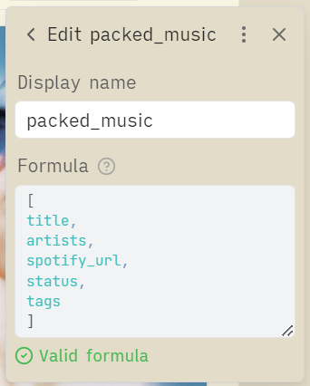
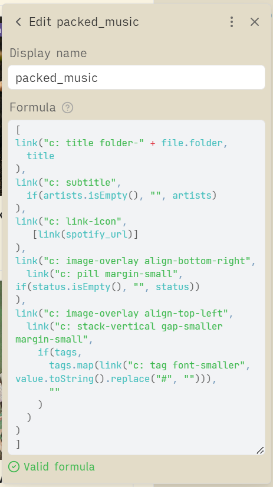

# ⚠️ LEGACY DOCUMENTATION - OUT OF DATE

> **This is the original guide preserved for historical reference.**
> 
> **For current best practices, see the main [README.md](README.md)**
> 
> **What changed:** Obsidian now provides an `html()` function that renders arbitrary HTML directly in formulas. This eliminates the need for the `link()` workarounds described below and allows for writing more familiar HTML and CSS.
> 
> **Migration:** See the main [README.md](README.md) for examples using `html()`.
> 
> **Note:** The `link()` approach still works, but Obsidian 1.10.3 changed CSS styling for links, causing multiple link icons to appear. A CSS workaround is available in [issue #1](https://github.com/EzraMarks/obsidian-bases-css-guide/issues/1), though migrating to `html()` is recommended.


---

## Obsidian Bases Cards CSS Guide

### Contents

- [Introduction](#introduction)
- [The Problem](#the-problem)
    - [Fixed Heights and Absolute Positioning](#fixed-heights-and-absolute-positioning)
    - [Uncontrollable Card Height Expansion](#uncontrollable-card-height-expansion)
    - [No Property-based Styling](#no-property-based-styling)
- [The Solution](#the-solution)
    - [Packing Properties](#packing-properties)
    - [Adding Spacers](#adding-spacers)
    - [Using Link Selectors](#using-link-selectors)
    - [Building Structure with Nested Lists](#building-structure-with-nested-lists)
- [Full Example](#full-example)
- [Limitations](#limitations)
    - [Pre-Populating YAML Frontmatter in New Note](#pre-populating-yaml-frontmatter-in-new-note)

**Want to play with a working example?** See [examples/legacy-example](examples/legacy-example).

### Introduction

The [Obsidian Bases](https://help.obsidian.md/bases) cards view (introduced in v1.9) displays your notes in a gallery-style grid. While the community has created beautiful card layouts using CSS, they've hit fundamental limitations: uncontrollable card height, no responsive layout control, and no CSS targeting of property values.

This guide shows how to overcome these limitations using vanilla Obsidian Bases and CSS—no plugins required.

In the following screenshots, note the following which were not previously possible:

- There are "album" or "song" icons before the title, created with CSS based on a property value (the note's parent folder)
- Tags are aligned to the upper-left of the image, even when the card size changes
- The subtitle responsively adjusts position when the title wraps
- The card height is not too tall, despite there being 5 properties displayed (tags, status pill, title, subtitle, external link)


### The Problem

Community members have identified several current blockers when customizing Bases cards:

#### Fixed Heights and Absolute Positioning

> "Since Cards and their contents are layed out using absolute positioning, it is not possible to use regular CSS layouts like flex, grid and auto sizing to change up the layout. And even if the elements are rearanged using other methods, the height of cards is not modifiable which can lead to blank space or overflow."
> 
> — TomasWeiss, [Improve compatibility of Bases Cards with CSS Snippets - Obsidian Forum](https://forum.obsidian.md/t/improve-compatibility-of-bases-cards-with-css-snippets/104590)

#### Uncontrollable Card Height Expansion

> "Hi, I have a CSS snippet that adds a bit of design to my book cards, but my main problem was that as I added new fields to the card, its height increased, maybe someone has encountered this, how can I reduce the height of all the cards at once."
> 
> 
> — Flassu, [How change cards height in bases - Obsidian Forum](https://forum.obsidian.md/t/how-change-cards-height-in-bases/105618)

#### No Property-based Styling

> "I want to be able to assign a CSS class to a property, similar to how you can use `cssclasses` in notes... I have a course tracker with a `status` property (Not Started, In Progress, Completed, Dropped). I want to render these as pills, with different colors for each status."
> — Gransoni, [Bases: Support CSS Customizations for Properties - Obsidian Forum](https://forum.obsidian.md/t/bases-support-css-customizations-for-properties/104752)

### The Solution

The solution is powered by four core techniques, which can be combined to create just about any CSS and HTML layout:

- **Packing Properties** — combine all visible property values into a [list](https://help.obsidian.md/bases/functions#List) in one formula, so the card's intrinsic height comes from a single property only
- **Adding Spacers** — add deliberate vertical space in a coarse-grain but predicable way
- **Using Links Selectors** — use the [link function](https://help.obsidian.md/bases/functions#Link) href value as a targetable CSS attribute, equivalent to a CSS class
- **Building Structure with Nested Lists** —  construct HTML DOM structure by nesting lists and links inside the formula; this gives you relative positioning and clean layout control

#### Packing Properties

Create a formula property whose value is a [list](https://help.obsidian.md/bases/functions#List) containing every value you plan to display on the card. This keeps the card's height fixed, rather than increasing when more properties are added.

**Before:**

|  |  |
| ------------------------------------ | ------------------------------------------ |

**After:**

|  |  |  |
| -------------------------------------- | -------------------------------------------- | ----------------------------------- |

The "after" doesn't look all that beautiful yet, but we've achieved our first goal: the card height no longer increases when we add properties. You can inspect-element in the Obsidian debugger to see that all the property values are there on the page, they're just overflowing off the card right now; we'll fix that soon with CSS.

**Notes**
- In this guide, the formula name for all packed property are prefixed with `packed_`, which allows them to be targeted with shared CSS styles
- The initial name of an Obsidian formula becomes the CSS-targetable name, even after it is renamed; make sure the initial name is correct

**Example Formula:**

```
[
title,
artists,
spotify_url,
status,
tags
]

```

#### Adding Spacers

If you need more vertical space on the card, create empty formula properties that can be easily hidden with CSS.

|  |  |  |
| --------------------- | --------------------------- | ------------------------ |

Not exactly pretty, but you can see that the card now has some whitespace under the title.

In this guide, the spacers are named with the `spacer_` prefix, to allow for shared CSS styles to make them invisible, while still increasing the card height by a fixed amount. The value of the formula can be completely empty.

CSS to hide spacers:

```
.bases-cards-property[data-property^="formula.spacer"] {
  display: none;
}
```

#### Using Link Selectors

Inside a formula, the [link function](https://help.obsidian.md/bases/functions#Link) can be exploited to be incredibly powerful: it can create a new HTML element with a targetable CSS attribute.

The `link()` function takes two arguments: the `path` and the `value`. The `path` becomes the href of an HTML link, which is a targetable attribute in CSS. The `value` becomes the contents of the link, which can be text or nested HTML elements.

If all of that sounded like gobbledygook, here's what it looks like in practice:

```
[
link("c: title folder-" + file.folder, title),
link("c: subtitle", artists),
link("c: link-icon", spotify_url),
link("c: status-pill", status),
link("c: tags", tags)
]
```

We prefix paths with "c:" (short for "class") so they're parsed as valid hrefs—anything that looks like a protocol scheme works, but this guide always uses "c:". Then, we add space-separated flags (like "title" or "status-pill"), similar to how you would list multiple class names in HTML.

With this structure, we can write simple CSS selectors like the following:

```
.bases-cards-property[data-property^="formula.packed"] a[href~="title"] {
  /* Your CSS here */
}
```

We can also write much more powerful CSS selectors. Notice how our first link has the following href/path: `"c: title folder-" + file.folder`. This is concatenating the folder path onto a "folder-" prefix, allowing us to have different CSS styles depending on which folder the note is in:

```
.bases-cards-property[data-property^="formula.packed"] a[href~="title"][href~="folder-Catalogs/Music/Albums"]::before {
    /* Your CSS here */
}
```

#### Building Structure with Nested Lists

While creating a list of targetable link elements is very powerful, it still does not allow for every kind of relative positioning; for that, we need to be able to create a nested HTML structure. By combining lists and links, we can create any HTML structure imaginable.

Here is the formula for the packed property I am currently using for my music library:

```
[
link("c: title folder-" + file.folder,
  title
),
link("c: subtitle",
  if(artists.isEmpty(), "", artists)
),
link("c: link-icon",
   [link(spotify_url)]
),
link("c: image-overlay align-bottom-right",
  link("c: pill margin-small", if(status.isEmpty(), "", status))
),
link("c: image-overlay align-top-left",
  link("c: stack-vertical gap-smaller margin-small",
    if(tags,
      tags.map(link("c: tag font-smaller", value.toString().replace("#", ""))),
      ""
    )
  )
)
]
```

I have created a set of CSS utility classes like "align-top-left" and "font-smaller", which allow for controlling the styling of a property right from the formula editor, without defining new CSS classes. Using utility classes like this is completely optional and a matter of personal preference.

### Full Example

Download this example at [examples/legacy-example](examples/legacy-example).

#### Final Result


#### Properties

|  |  |  |
| -------------------------------- | ----------------------------- | ------------------------ |

<details>
<summary>View Formula for "packed_music" Property</summary>

<pre><code>
[
link("c: title folder-" + file.folder,
  title
),
link("c: subtitle",
  if(artists.isEmpty(), "", artists)
),
link("c: link-icon",
   [link(spotify_url)]
),
link("c: image-overlay align-bottom-right",
  link("c: pill margin-small", if(status.isEmpty(), "", status))
),
link("c: image-overlay align-top-left",
  link("c: stack-vertical gap-smaller margin-small",
    if(tags,
      tags.map(link("c: tag font-smaller", value.toString().replace("#", ""))),
      ""
    )
  )
)
]
</code></pre>
</details>

#### CSS

<details>
<summary>View Full CSS Code</summary>

<pre><code class="language-css">
/*
Obsidian Bases Cards CSS Guide
https://github.com/EzraMarks/obsidian-bases-css-guide

This CSS enables advanced card layouts for Obsidian Bases using the "property packing" technique
and other techniques described in the README of the above repo.

Structure:
- Core Setup: Required CSS for property packing technique
- Starter Styles: Optional utility classes
- Example Implementation: CSS for the music library example

Conventions:
- Formula properties prefixed with "packed_" for packed properties
- Formula properties prefixed with "spacer_" for adding vertical space
- Link hrefs prefixed with "c:" (short for "classes") to act as CSS selectors
*/

/* ======== Core Setup (recommended for property packing technique) ======== */

/* Allow overflow so elements can use absolute positioning beyond card boundaries */
.bases-cards-property[data-property^="formula.packed"] .bases-cards-line,
.bases-cards-property[data-property^="formula.packed"] {
    overflow: visible;
}

/* Preserve normal formatting when packed properties appear in title position;
   without this, Obsidian would apply title-specific styles */
.bases-cards-property.mod-title[data-property^="formula.packed"] {
    --link-color: revert;
    --link-unresolved-color: revert;
    --link-unresolved-opacity: revert;
    --link-decoration: revert;
    --link-weight: revert;
    pointer-events: revert;
    font-weight: revert;
}

/* Remove link styling from all "c:" prefixed hrefs; we are using links to exploit the
   href attribute as a CSS selector, but we want the element to behave like a regular span */
.bases-cards-property[data-property^="formula.packed"] a[href^="c:"] {
    color: var(--text-normal);
    pointer-events: none;
    text-decoration: none;
}

/* Make spacer properties invisible; these properties are prefixed with the name "spacer"
   and only serve to add height to the card */
.bases-cards-property[data-property^="formula.spacer"] {
    display: none;
}

/* ======== Starter Styles (optional utility CSS) ======== */

.bases-cards-item {
    /* CSS variable, useful for absolute positioning from bottom of cover image */
    --bases-cards-bottom-offset: calc(var(--bases-cards-line-height) + 8px);
}

/* Theme-specific overlay colors for pills and tags; provides high contrast overlays
   that work in both light and dark themes */
.theme-light {
    --custom-bases-overlay-background-color: color-mix(in srgb, var(--text-normal) 70%, transparent);
    --custom-bases-overlay-text-color: var(--background-primary);
}

.theme-dark {
    --custom-bases-overlay-background-color: var(--background-primary);
    --custom-bases-overlay-text-color: var(--text-color);
}

/* image-overlay: position a container over the card's cover image (assuming square aspect ratio)
   Example usage: link("c: image-overlay", content) */
.bases-cards-property[data-property^="formula.packed"] a[href~="image-overlay"] {
    position: absolute;
    left: 0;
    bottom: var(--bases-cards-bottom-offset);
    display: flex;
    width: 100%;
    /* Matches square cards - change to match your card aspect ratio */
    aspect-ratio: 1;
}

/* align-top-left: align content to top-left corner
   Example usage: link("c: image-overlay align-top-left", content) */
.bases-cards-property[data-property^="formula.packed"] a[href~="align-top-left"] {
    display: flex;
    justify-content: flex-start;
    align-items: flex-start;
}

/* align-bottom-right: align content to bottom-right corner
   Example usage: link("c: image-overlay align-bottom-right", content) */
.bases-cards-property[data-property^="formula.packed"] a[href~="align-bottom-right"] {
    display: flex;
    justify-content: flex-end;
    align-items: flex-end;
}

/* stack-vertical: stack child elements vertically
   Example usage: link("c: stack-vertical", [item1, item2, item3]) */
.bases-cards-property[data-property^="formula.packed"] a[href~="stack-vertical"]>.value-list-container {
    display: flex;
    flex-direction: column;
    align-items: flex-start;
}

/* gap-small: set small gap between child elements
   Example usage: link("c: stack-vertical gap-small", list) */
.bases-cards-property[data-property^="formula.packed"] a[href~="gap-small"]>.value-list-container {
    gap: var(--size-2-2);
}

/* gap-smaller: set smaller gap between child elements
   Example usage: link("c: stack-vertical gap-smaller", list) */
.bases-cards-property[data-property^="formula.packed"] a[href~="gap-smaller"]>.value-list-container {
    gap: var(--size-2-1);
}

/* margin-small: set small margin around element
   Example usage: link("c: pill margin-small", status) */
.bases-cards-property[data-property^="formula.packed"] a[href~="margin-small"] {
    margin: var(--size-2-3);
}

/* font-smaller: set font size to Obsidian smaller font
   Example usage: link("c: tag font-smaller", tagName) */
.bases-cards-property[data-property^="formula.packed"] a[href~="font-smaller"] {
    font-size: var(--font-smaller);
}

/* title: main card title with line wrap and ellipsis overflow
   Example usage: link("c: title", title) */
.bases-cards-property[data-property^="formula.packed"] a[href~="title"] {
    margin-bottom: var(--size-2-2);
    font-weight: calc(var(--font-weight) + var(--bold-modifier));
    color: var(--text-normal);
    font-size: 0.9em;
    line-height: 1.4;
    display: -webkit-box;
    -webkit-line-clamp: 2;
    -webkit-box-orient: vertical;
    overflow: hidden;
    text-wrap: pretty;
}

/* subtitle: card subtitle with ellipsis overflow
   Example usage: link("c: subtitle", artists) */
.bases-cards-property[data-property^="formula.packed"] a[href~="subtitle"] {
    font-size: var(--font-small);
    line-height: 2;
    display: block;
}

.bases-cards-property[data-property^="formula.packed"] a[href~="subtitle"] .value-list-container {
    overflow: hidden;
    text-overflow: ellipsis;
}

/* pill: rounded status pill
   Example usage: link("c: pill margin-small", status) */
.bases-cards-property[data-property^="formula.packed"] a[href~="pill"]:not(:empty) {
    padding: 4px 10px;
    background: var(--custom-bases-overlay-background-color);
    color: var(--custom-bases-overlay-text-color);
    font-weight: 600;
    border-radius: 9999px;
    box-shadow: 0 2px 4px rgba(0, 0, 0, 0.3);
    font-size: 0.9rem;
}

/* tag: rounded pill with accent coloring
   Example usage: tags.map(link("c: tag font-smaller", value)) */
.bases-cards-property[data-property^="formula.packed"] a[href~="tag"] {
    display: inline-block;
    background-color: color-mix(in srgb, var(--color-accent-2) 56%, black 22%);
    color: color-mix(in srgb, var(--color-accent-2) 10%, white 100%);
    box-shadow: var(--shadow-s);
    border-radius: var(--tag-radius);
    padding: var(--tag-padding-y) var(--tag-padding-x);
}

/* ======== Example Implementation (styles specific to the Music Library example) ======== */

.bases-cards-property[data-property^="formula.packed"] a[href~="subtitle"] {
    width: calc(100% - 32px);
    /* Leave space for link icon */
}

/* link-icon: clickable link icon, positioned at the bottom right of the card
   Example usage: link("c: link-icon", link(your_url_property))
   Note that nested link pattern is required - outer link positions, inner link provides the URL */
.bases-cards-property[data-property^="formula.packed"] a[href~="link-icon"] a {
    pointer-events: auto;
    /* Re-enable clicking for this specific link */
    position: absolute;
    right: 8px;
    bottom: -46px;
    width: 18px;
    aspect-ratio: 1;
    background-color: var(--text-normal);
    color: var(--text-normal);
    mask-image: url('data:image/svg+xml,<svg xmlns="http://www.w3.org/2000/svg" viewBox="0 0 24 24"><path d="M19 19H5V5h7V3H5c-1.11 0-2 .9-2 2v14c0 1.1.89 2 2 2h14c1.1 0 2-.9 2-2v-7h-2v7zM14 3v2h3.59l-9.83 9.83 1.41 1.41L19 6.41V10h2V3h-7z"/></svg>');
}

/* Title type icons - base style for folder-based icons */
.bases-cards-property[data-property^="formula.packed"] a[href~="title"][href*="folder-"]::before {
    display: inline-block;
    content: "";
    height: 1.1em;
    margin-right: var(--size-2-3);
    aspect-ratio: 1;
    background-color: var(--text-muted);
    mask-size: contain;
    mask-position: center;
    mask-repeat: no-repeat;
    vertical-align: middle;
    margin-top: -3px;
    /* Fine-tune alignment with text baseline */
}

/* Album icon - specific to folder path that contains "Music Library/Albums".
   Note that a better selector would be [href~="folder-Music Library/Albums"],
   but the following less-specific selector allows the example folder to be under any parent folder */
.bases-cards-property[data-property^="formula.packed"] a[href~="title"][href*="folder-"][href*="Music Library/Albums"]::before {
    mask-image: url('data:image/svg+xml,<svg xmlns="http://www.w3.org/2000/svg" viewBox="0 0 24 24"><path d="M12 2C6.48 2 2 6.48 2 12s4.48 10 10 10 10-4.48 10-10S17.52 2 12 2zm0 14.5c-2.49 0-4.5-2.01-4.5-4.5S9.51 7.5 12 7.5s4.5 2.01 4.5 4.5-2.01 4.5-4.5 4.5zm0-5.5c-.55 0-1 .45-1 1s.45 1 1 1 1-.45 1-1-.45-1-1-1z"/></svg>');
}

/* Track icon - specific to folder path that contains "Music Library/Tracks" */
.bases-cards-property[data-property^="formula.packed"] a[href~="title"][href*="folder-"][href*="Music Library/Tracks"]::before {
    mask-image: url('data:image/svg+xml,<svg xmlns="http://www.w3.org/2000/svg" viewBox="0 0 24 24"><path d="M12 3v10.55c-.59-.34-1.27-.55-2-.55-2.21 0-4 1.79-4 4s1.79 4 4 4 4-1.79 4-4V7h4V3h-6z"/></svg>');
}
</code></pre>
</details>

### Limitations

#### Pre-Populating YAML Frontmatter in New Note

When using the "packed property" method, creating a new note with the "+ New" button in the Cards view will not pre-populate any YAML frontmatter, because Obsidian does not know which properties are displayed on the card.

If this feature is important to you, a simple workaround is to create a secondary view (e.g. a Table view) using standard property selection, and using that view to create new notes using "+ New".

**Cards view using a packed property:**

Clicking "+ New" does not pre-populate YAML frontmatter in the new note.


**Table view using standard properties:**

Clicking "+ New" pre-populates YAML frontmatter in the new note.

