## Obsidian Bases Cards CSS Guide

### Contents

- [Introduction](#introduction)
- [Important Update](#important-update)
- [The Problem](#the-problem)
    - [Fixed Heights and Absolute Positioning](#fixed-heights-and-absolute-positioning)
    - [Uncontrollable Card Height Expansion](#uncontrollable-card-height-expansion)
    - [No Property-based Styling](#no-property-based-styling)
- [The Solution](#the-solution)
    - [Packing Properties](#packing-properties)
    - [Adding Spacers](#adding-spacers)
    - [Rendering HTML](#rendering-html)
- [Full Example](#full-example)
- [CSS Framework Reference](#css-framework-reference)
- [Limitations](#limitations)
    - [Pre-Populating YAML Frontmatter in New Note](#pre-populating-yaml-frontmatter-in-new-note)
- [Legacy Approach](#legacy-approach)

**Want to play with a working example?** Download the [examples/current-example](examples/current-example) folder and follow the contained README.

### Introduction

The [Obsidian Bases](https://help.obsidian.md/bases) cards view (introduced in v1.9) displays your notes in a gallery-style grid. While the community has created beautiful card layouts using CSS, they've hit fundamental limitations: uncontrollable card height, no responsive layout control, and no CSS targeting of property values.

This guide shows how to overcome these limitations using vanilla Obsidian Bases and CSS—no plugins required.

In the following screenshots, note the following which were not previously possible:

- There are "album" or "song" icons before the title, created with CSS based on a property value (the note's parent folder)
- Tags are aligned to the upper-left of the image, even when the card size changes
- The subtitle responsively adjusts position when the title wraps
- The card height is not too tall, despite there being 5 properties displayed (tags, status pill, title, subtitle, external link)

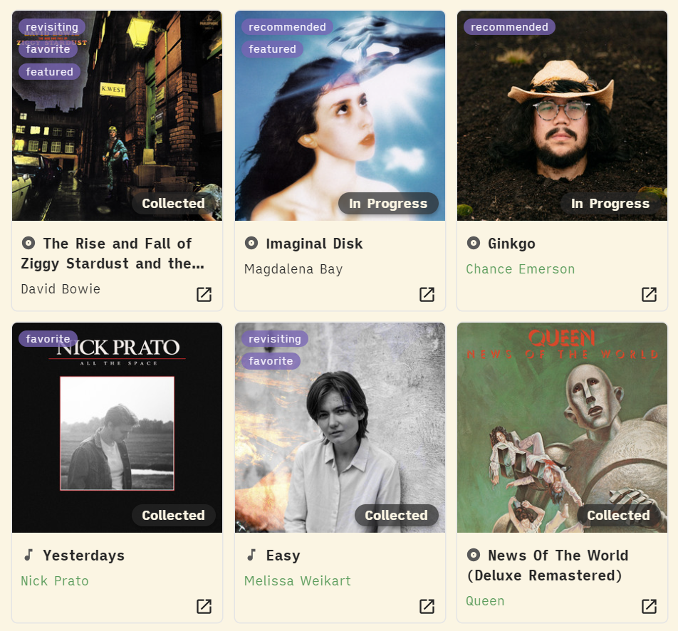

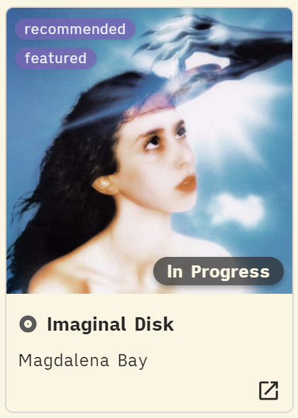

### Important Update

**Obsidian 1.10.3 (November 11, 2025) introduced an `html()` function** that renders arbitrary HTML directly in formulas. This is now the recommended approach for building card layouts, as it allows for writing more standard HTML and CSS, without fighting Obsidian default styles.

**The original `link()` technique** still works but requires additional CSS to fix link icon issues also introduced in this update. See [LEGACY-README.md](LEGACY-README.md) for details.

### The Problem

Community members have identified several current blockers when customizing Bases cards:

#### Fixed Heights and Absolute Positioning

> "Since Cards and their contents are layed out using absolute positioning, it is not possible to use regular CSS layouts like flex, grid and auto sizing to change up the layout. And even if the elements are rearanged using other methods, the height of cards is not modifiable which can lead to blank space or overflow."
> 
> 
> — TomasWeiss, [Improve compatibility of Bases Cards with CSS Snippets - Obsidian Forum](https://forum.obsidian.md/t/improve-compatibility-of-bases-cards-with-css-snippets/104590)

#### Uncontrollable Card Height Expansion

> "Hi, I have a CSS snippet that adds a bit of design to my book cards, but my main problem was that as I added new fields to the card, its height increased, maybe someone has encountered this, how can I reduce the height of all the cards at once."
> 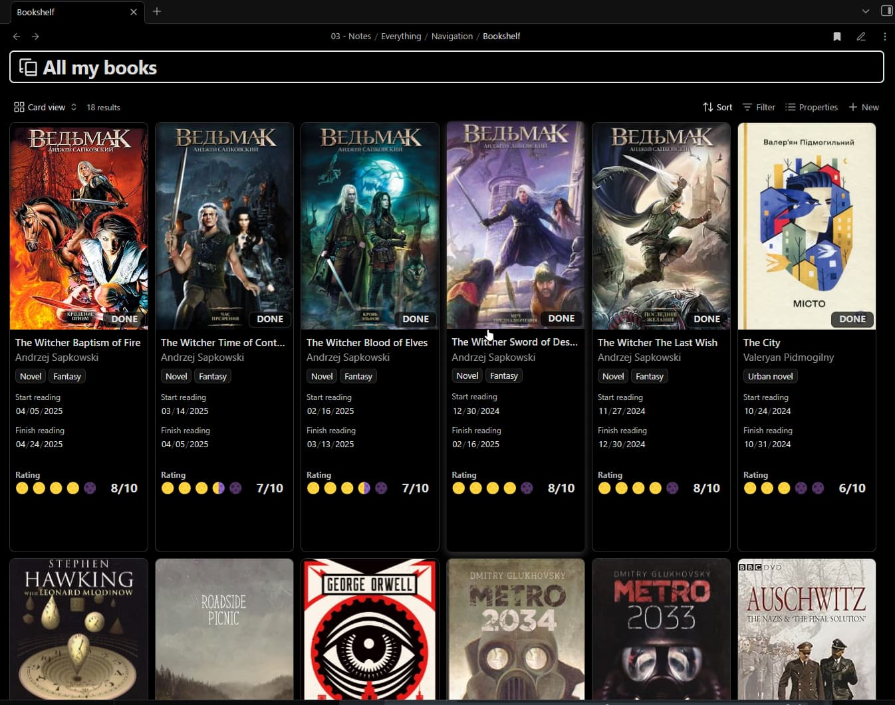
> 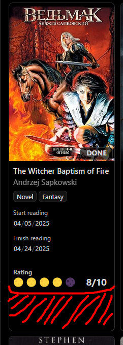
> 
> — Flassu, [How change cards height in bases - Obsidian Forum](https://forum.obsidian.md/t/how-change-cards-height-in-bases/105618)

#### No Property-based Styling

> "I want to be able to assign a CSS class to a property, similar to how you can use `cssclasses` in notes... I have a course tracker with a `status` property (Not Started, In Progress, Completed, Dropped). I want to render these as pills, with different colors for each status."
> 
> — Gransoni, [Bases: Support CSS Customizations for Properties - Obsidian Forum](https://forum.obsidian.md/t/bases-support-css-customizations-for-properties/104752)

### The Solution

The solution is powered by three core techniques, which can be combined to create any CSS and HTML layout:

- **Packing Properties** — combine all visible property values into one formula, so the card's intrinsic height comes from a single property only
- **Adding Spacers** — add deliberate vertical space in a coarse-grain but predictable way
- **Rendering HTML** — use the `html()` function with template strings to render arbitrary HTML and CSS with dynamic data

#### Packing Properties

Create a formula property containing every value you plan to display on the card. This keeps the card's height fixed, rather than increasing when more properties are added.

**Before:**

| 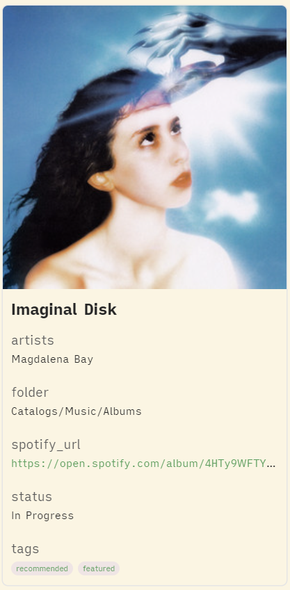 | 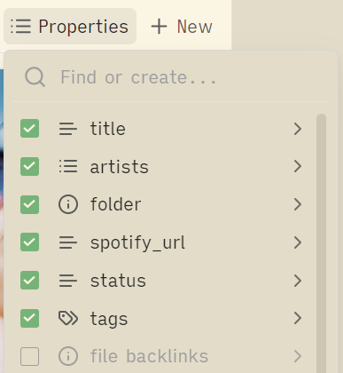 |
| ------------------------------------ | ------------------------------------------ |

**After:**

| 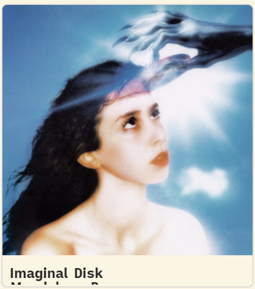 | 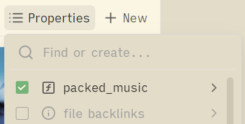 | 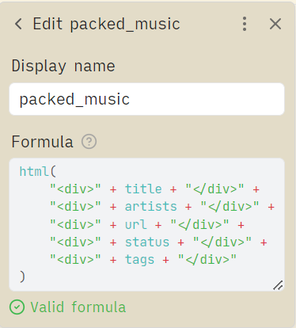 |
| -------------------------------------- | -------------------------------------------- | ----------------------------------- |

The "after" doesn't look all that beautiful yet, but we've achieved our first goal: the card height no longer increases when we add properties. All the property values are there on the page, they're just overflowing off the card right now; we'll fix that soon with CSS.

**Notes**
- In this guide, the formula name for all packed properties are prefixed with `packed_`, which allows them to be targeted with shared CSS styles
- In this guide, the formula name for all packed properties are prefixed with `packed_`, which allows them to be targeted with shared CSS styles
- The initial name of an Obsidian formula becomes the CSS-targetable name, even after it is renamed; make sure the initial name is correct

**Example Formula:**

```javascript
html(
    "<div>" + title + "</div>" +
    "<div>" + artists + "</div>" +
    "<div>" + url + "</div>" +
    "<div>" + status + "</div>" +
    "<div>" + tags + "</div>"
)
```

#### Adding Spacers

If you need more vertical space on the card, create empty formula properties that can be easily hidden with CSS.

| 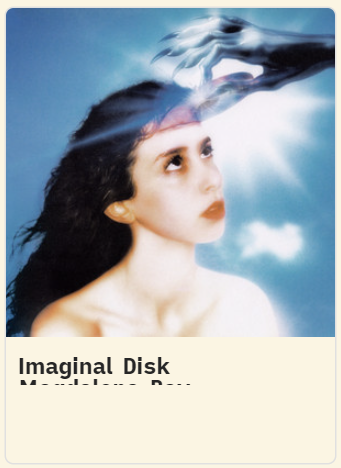 |  | 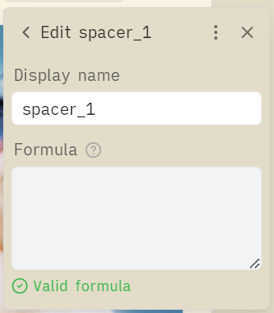 |
| --------------------- | --------------------------- | ------------------------ |

Not exactly pretty, but you can see that the card now has some whitespace under the title.

In this guide, the spacers are named with the `spacer_` prefix, to allow for shared CSS styles to make them invisible, while still increasing the card height by a fixed amount. The value of the formula can be completely empty.

CSS to hide spacers:

```css
.bases-cards-property[data-property^="formula.spacer"] {
  display: none;
}
```

#### Rendering HTML

The `html()` function allows you to render arbitrary HTML in your formulas.

**Basic Usage:**

```javascript
html("<div class='title'>My Title</div>")
```

**With Property Values:**

```javascript
html("<div class='title'>" + title + "</div>")
```

**The Template String Pattern:**

Build HTML templates with placeholders like `{title}`, then use `.replace()` to populate them:

```javascript
html(
  (
    "<div class='title'>{title}</div>" +
    "<div class='subtitle'>{subtitle}</div>"
  )
    .replace("{title}", title)
    .replace("{subtitle}", subtitle)
)
```

This separates structure (HTML template) from data (property values), making formulas more readable and easier to modify. The `.replace()` pattern also lets you handle conditional content, arrays, and other dynamic data:

**Conditional Content:**

Show fallback values when properties are empty.

```javascript
.replace("{status}", if(status, status, "None"))
```

**Array Mapping:**

Transform arrays properties into HTML.

```javascript
.replace("{tags}",
  if(tags,
    tags.map(
      "<div class='tag'>" + value.toString() + "</div>"
    ).join(""),
    ""
  )
)
```

**Complex Nested Layouts:**

Combine techniques to build complete card layouts.

```javascript
html(
  (
    "<div class='cover-overlay aspect-square'>" +
      "<div class='align-top-left'>" +
        "<div class='stack-vertical'>{tags}</div>" +
      "</div>" +
      "<div class='align-bottom-right'>" +
        "<div class='pill'>{status}</div>" +
      "</div>" +
    "</div>"
  )
    .replace("{tags}",
      if(tags,
        tags.map(
          "<div class='tag'>" + value.toString() + "</div>"
        ).join(""),
        ""
      )
    )
    .replace("{status}", if(status, status, "None"))
)
```

**Wikilink Conversion:**

Obsidian wikilinks do not work when rendered as HTML; they become plain text like "[[My Note]]". Use this regex pattern to convert them into clickable HTML links whenever you need wikilinks displayed on cards.

```javascript
.replace(/\[\[([^\|\]]+)\|([^\]]+)\]\]/g, 
  "<a href='obsidian://open?file=$1'>$2</a>")
.replace(/\[\[([^\]]+)\]\]/g, 
  "<a href='obsidian://open?file=$1'>$1</a>")
```

### Full Example

Download this example at [examples/current-example](examples/current-example).

#### Final Result


#### Properties

| 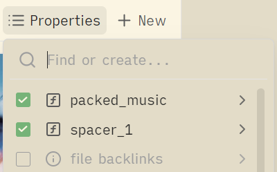 | 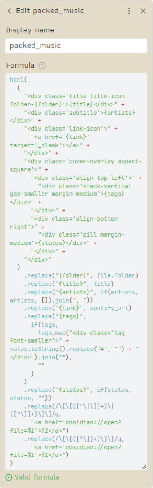 |  |
| -------------------------------- | ----------------------------- | ------------------------ |

<details>
<summary>View Formula for "packed_music" Property</summary>

<pre><code>
html(
  (
    "&lt;div class='title title-icon folder-{folder}'&gt;{title}&lt;/div&gt;" +
    "&lt;div class='subtitle'&gt;{artists}&lt;/div&gt;" +
    "&lt;div class='link-icon'&gt;" +
      "&lt;a href='{link}' target='_blank'&gt;&lt;/a&gt;" +
    "&lt;/div&gt;" +
    "&lt;div class='cover-overlay aspect-square'&gt;" +
      "&lt;div class='align-top-left'&gt;" +
        "&lt;div class='stack-vertical gap-smaller margin-medium'&gt;{tags}&lt;/div&gt;" +
      "&lt;/div&gt;" +
      "&lt;div class='align-bottom-right'&gt;" +
        "&lt;div class='pill margin-medium'&gt;{status}&lt;/div&gt;" +
      "&lt;/div&gt;" +
    "&lt;/div&gt;"
  )
    .replace("{folder}", file.folder)
    .replace("{title}", title)
    .replace("{artists}", if(artists, artists, []).join(", "))
    .replace("{link}", spotify_url)
    .replace("{tags}",
      if(tags,
        tags.map("&lt;div class='tag font-smaller'&gt;" + value.toString().replace("#", "") + "&lt;/div&gt;").join(""),
        ""
      )
    )
    .replace("{status}", if(status, status, ""))
    .replace(/\[\[([^\|\]]+)\|([^\]]+)\]\]/g,
      "&lt;a href='obsidian://open?file=$1'&gt;$2&lt;/a&gt;")
    .replace(/\[\[([^\]]+)\]\]/g,
      "&lt;a href='obsidian://open?file=$1'&gt;$1&lt;/a&gt;")
)
</code></pre>
</details>

#### CSS

<details>
<summary>View Full CSS Code</summary>

<pre><code class="language-css">
/*
Obsidian Bases Cards CSS
https://github.com/EzraMarks/obsidian-bases-css-guide

This CSS enables advanced card layouts for Obsidian Bases using the "property packing" technique
and other techniques described in the README of the above repo.

Structure:
- Core Setup (required): CSS for property packing technique
- Everything else (optional): Utility classes and pre-styled components

Conventions:
- Formula properties prefixed with "packed_" for packed properties
- Formula properties prefixed with "spacer_" for adding vertical space
*/

/* ======== Core Setup (required for property packing technique) ======== */

/* Make spacer properties invisible; these properties are prefixed with the name "spacer"
   and only serve to add height to the card */
.bases-cards-property[data-property^="formula.spacer"] {
    display: none;
}

/* Allow overflow so elements can use absolute positioning beyond card boundaries */
.bases-cards-property[data-property^="formula.packed"] {
    overflow: visible;

    .bases-cards-line {
        overflow: visible;
    }

    /* Preserve normal formatting when packed properties appear in title position;
       without this, Obsidian would apply title-specific styles */
    &.mod-title {
        --link-color: revert;
        --link-unresolved-color: revert;
        --link-unresolved-opacity: revert;
        --link-decoration: revert;
        --link-weight: revert;
        font-weight: revert;
        pointer-events: auto;
    }

    /* ======== Cover Overlay & Positioning ======== */

    /* Position a container over the card's cover image */
    .cover-overlay {
        position: absolute;
        left: 0;
        bottom: var(--bases-cards-bottom-offset);
        display: flex;
        width: 100%;
        overflow: hidden;

        &.aspect-square {
            aspect-ratio: 1 / 1;
        }

        &.aspect-2\/3 {
            aspect-ratio: 2 / 3;
        }

        /* Alignment positions for content within the overlay */

        >.align-top-left {
            position: absolute;
            top: 0;
            left: 0;
            display: flex;
            justify-content: flex-start;
            align-items: flex-start;
        }

        >.align-bottom-left {
            position: absolute;
            bottom: 0;
            left: 0;
            display: flex;
            justify-content: flex-start;
            align-items: flex-end;
        }

        >.align-bottom-right {
            position: absolute;
            bottom: 0;
            right: 0;
            display: flex;
            justify-content: flex-end;
            align-items: flex-end;
        }
    }

    /* ======== Layout Utilities ======== */

    .stack-horizontal {
        display: flex;
        flex-direction: row;
        align-items: center;
        width: 100%;
    }

    .stack-vertical {
        display: flex;
        flex-direction: column;
        align-items: flex-start;
    }

    .space-between {
        justify-content: space-between;
    }

    .gap-smaller {
        gap: var(--size-2-1);
    }

    .gap-small {
        gap: var(--size-2-2);
    }

    .gap-medium {
        gap: var(--size-2-3);
    }

    .margin-small {
        margin: var(--size-2-2);
    }

    .margin-medium {
        margin: var(--size-2-3);
    }

    .margin-top-small {
        margin-top: var(--size-2-2);
    }

    /* Pull element upward with negative margin */
    .margin-top-negative-large {
        margin-top: calc(-1 * var(--size-4-2));
    }

    /* ======== Text Utilities ======== */

    .font-smaller {
        font-size: var(--font-smaller) !important;
    }

    /* Prevent text wrapping with ellipsis overflow */
    .no-wrap {
        display: block;
        white-space: nowrap;
        overflow: hidden;
        text-overflow: ellipsis;
    }

    /* Limit text to 2 lines with ellipsis overflow */
    .subtitle.wrap-2 {
        font-size: var(--font-small);
        line-height: 1.4;
        display: -webkit-box;
        -webkit-line-clamp: 2;
        -webkit-box-orient: vertical;
        overflow: hidden;
        text-overflow: ellipsis;
        text-wrap: pretty;
    }

    /* ======== Components ======== */

    .tag {
        display: inline-block;
        background-color: color-mix(in srgb, var(--color-accent-2) 56%, black 22%);
        color: color-mix(in srgb, var(--color-accent-2) 10%, white 100%);
        box-shadow: var(--shadow-s);
        border-radius: var(--tag-radius);
        padding: var(--tag-padding-y) var(--tag-padding-x);
    }

    .pill:not(:empty) {
        padding: 0.3em 0.75em;
        background: var(--custom-bases-overlay-background-color);
        color: var(--custom-bases-overlay-text-color);
        font-weight: 600;
        border-radius: 9999px;
        box-shadow: 0 2px 4px rgba(0, 0, 0, 0.3);
        font-size: 0.9rem;
        display: inline-flex;
        align-items: center;
    }

    .title {
        margin-bottom: var(--size-2-2);
        font-weight: calc(var(--font-weight) + var(--bold-modifier));
        color: var(--text-normal);
        font-size: 0.9em;
        line-height: 1.4;
        display: -webkit-box;
        -webkit-line-clamp: 2;
        -webkit-box-orient: vertical;
        overflow: hidden;
        text-wrap: pretty;
    }

    .subtitle {
        font-size: var(--font-small);
        display: block;
        overflow: hidden;
        text-overflow: ellipsis;
        white-space: nowrap;
    }

    /* Adds an icon before title text (requires additional CSS for specific icons) */
    .title-icon::before {
        display: inline-block;
        content: "";
        height: 1.1em;
        margin-right: var(--size-2-3);
        aspect-ratio: 1;
        background-color: var(--text-muted);
        mask-size: contain;
        mask-position: center;
        mask-repeat: no-repeat;
        vertical-align: middle;
        margin-top: -3px;
        /* Fine-tune alignment with text baseline */
    }
}

/* ======== Base Variables ======== */

.bases-cards-item {
    /* CSS variable, useful for absolute positioning from bottom of cover image */
    --bases-cards-bottom-offset: calc(var(--bases-cards-line-height) + 8px);
}

/* Theme-specific overlay colors for pills and tags; provides high contrast overlays
   that work in both light and dark themes */
.theme-light {
    --custom-bases-overlay-background-color: color-mix(in srgb, var(--text-normal) 70%, transparent);
    --custom-bases-overlay-text-color: var(--background-primary);
}

.theme-dark {
    --custom-bases-overlay-background-color: var(--background-primary);
    --custom-bases-overlay-text-color: var(--text-color);
}
</code></pre>
</details>

### CSS Framework Reference

The included CSS demonstrates useful patterns for utility classes and components. Use these as a starting point and build your own classes as needed.

**Layout Classes:**
- `.cover-overlay` with `.aspect-square` or `.aspect-2/3` - Container for positioning elements over cover image
- `.align-top-left`, `.align-bottom-left`, `.align-bottom-right` - Position children within overlay
- `.stack-horizontal`, `.stack-vertical` - Flexbox stacks
- `.space-between` - Justify content with space between

**Component Classes:**
- `.title` - Card title with 2-line clamping
- `.subtitle` - Smaller text with ellipsis overflow
- `.pill` - Rounded status badge
- `.tag` - Inline tag with accent coloring

**Utility Classes:**
- `.gap-smaller`, `.gap-small`, `.gap-medium` - Flex gaps
- `.margin-small`, `.margin-medium`, `.margin-top-small` - Margins
- `.margin-top-negative-large` - Pull element upward with negative margin
- `.font-smaller` - Smaller font size
- `.no-wrap` - Text truncation with ellipsis

### Limitations

#### Pre-Populating YAML Frontmatter in New Note

When using the "packed property" method, creating a new note with the "+ New" button in the Cards view will not pre-populate any YAML frontmatter, because Obsidian does not know which properties are displayed on the card.

If this feature is important to you, a simple workaround is to create a secondary view (e.g. a Table view) using standard property selection, and using that view to create new notes using "+ New".

**Cards view using a packed property:**

Clicking "+ New" does not pre-populate YAML frontmatter in the new note.

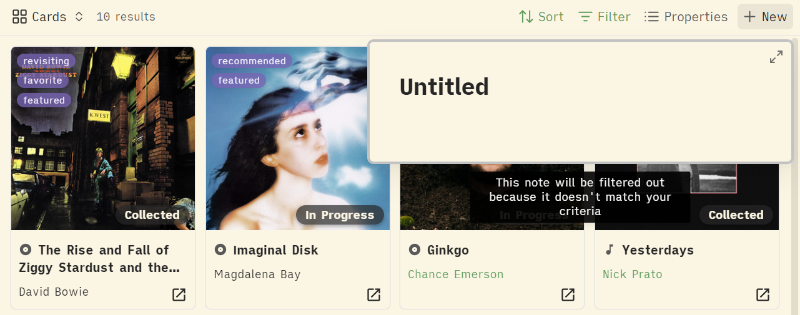

**Table view using standard properties:**

Clicking "+ New" pre-populates YAML frontmatter in the new note.

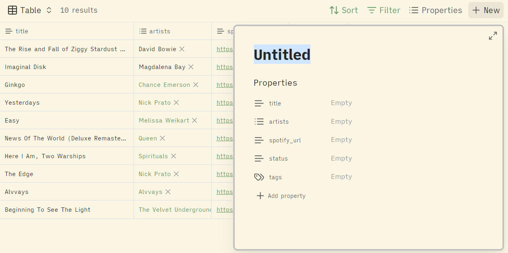


### Legacy Approach

The original version of this guide used the `link()` function with custom href attributes as CSS selectors. This approach still works but requires additional CSS workarounds due to the November 2025 update.

**For the complete legacy guide**, see [LEGACY-README.md](LEGACY-README.md).

**For a working legacy example**, see [examples/legacy-example](examples/legacy-example).

The `html()` function approach is recommended for all new projects.